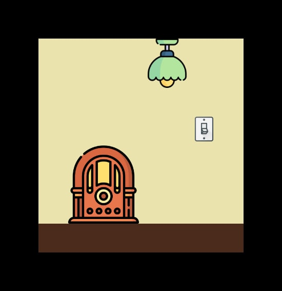

# Codo a Codo React: Ejercicio práctica DOM

Un cuarto tranquilo, perfecto para bajar las luces y disfrutar algunos clásicos del rock n roll. 

Ejercicio de práctica de manipulación del DOM.

[Link al ejercicio](https://pazspera.github.io/cac-react-practica-js/)

Iconos usados en el proyecto:
- [Old radio icons created by Freepik - Flaticon](https://www.flaticon.com/free-icons/old-radio)
- [Switch icons created by Those Icons - Flaticon](https://www.flaticon.com/free-icons/switch)
- [https://www.flaticon.com/free-icons/ceiling-lamp](https://www.flaticon.com/free-icons/ceiling-lamp)

